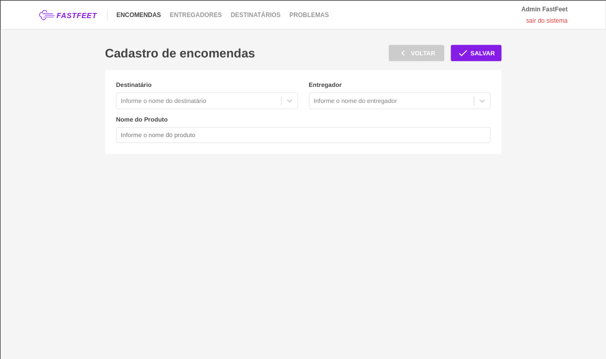
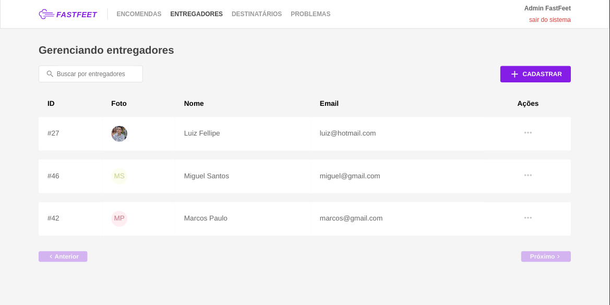
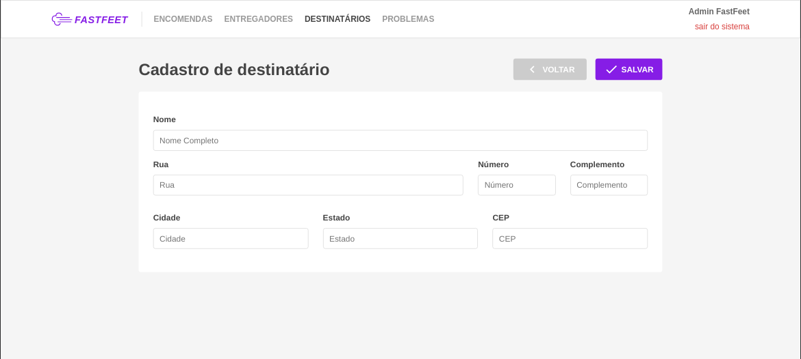
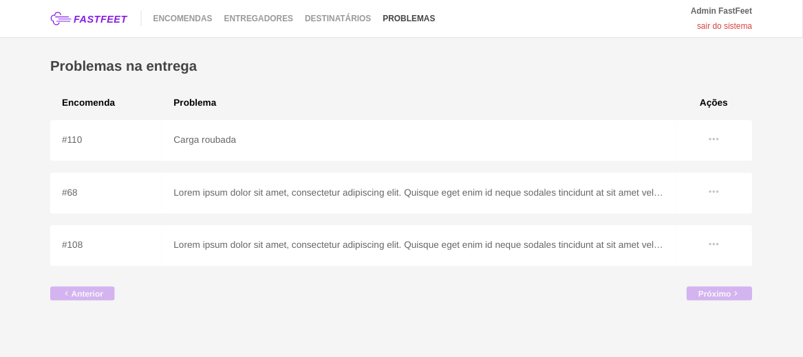
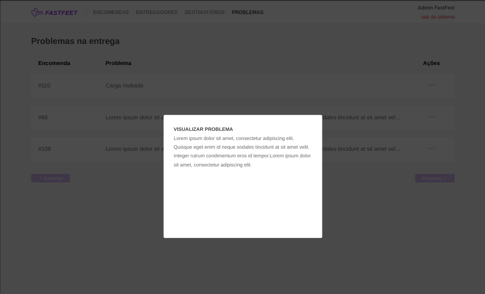

<h1 align="center">
  
</h1>

<h3 align="center">
  Desafio 9: FastFeet, front-end web
</h3>

<h3 align="center">
  :warning: Etapa 3/4 do Desafio Final :warning:
</h3>

Esse desafio faz parte do Desafio Final, que é uma aplicação completa (Back-end, Front-end e Mobile) que é avaliada para emissão do Certificado do Bootcamp GoStack, por isso é fundamental que ele seja feito com muito empenho!

<blockquote align="center">“Mude você e todo o resto mudará naturalmente”!</blockquote>

  <a href="#rocket-sobre-o-desafio">Sobre o desafio</a>&nbsp;&nbsp;&nbsp;|&nbsp;&nbsp;&nbsp;
  <a href="#informações-importantes">Informações Importantes</a>&nbsp;&nbsp;&nbsp;|&nbsp;&nbsp;&nbsp;
  <a href="#layout">Layout</a>&nbsp;&nbsp;&nbsp;|&nbsp;&nbsp;&nbsp;
  <a href="#demo">Demo</a>&nbsp;&nbsp;&nbsp;|&nbsp;&nbsp;&nbsp;

## 🚀 Sobre o desafio

Durante esse desafio construi o front-end da aplicação FastFeet que no qual criei o back-end durante os desafios dos módulos 02 e 03 de Node.js.

A versão web do projeto FastFeet representa a visão da distribuidora, ou seja, todas funcionalidades presentes na versão web são para administradores. As funcionalidades para o entregador serão dispostas no aplicativo mobile.

### Informações importantes

1. Antes de cancelar encomendas ou deletar qualquer registro do banco criei uma verificação adicinal usando a função `confirm` do JavaScript;
2. Para formatação de datas utilizei sempre a biblioteca `date-fns`;
3. No cadastro/edição de encomendas foi preciso buscar o entregador e o destinatário pelo nome. Utilizei o método `async` da biblioteca [React Select](https://react-select.com/home#async). As encomendas são buscadas da API assim que a página carregaa e não possuem filtro.

## Opcionais

1. Adicionei paginação no front-end e back-end para todas listagens;
2. Utilizei máscaras para o input de CEP;

## 🎨 Layout

O layout do desafio foi feito seguindo o protótipo disponivel nesse link : [Visualizar](https://xd.adobe.com/view/62e829fc-4f10-4ac8-70d2-d39b429d43ee-14d9/grid/)

### Demo

